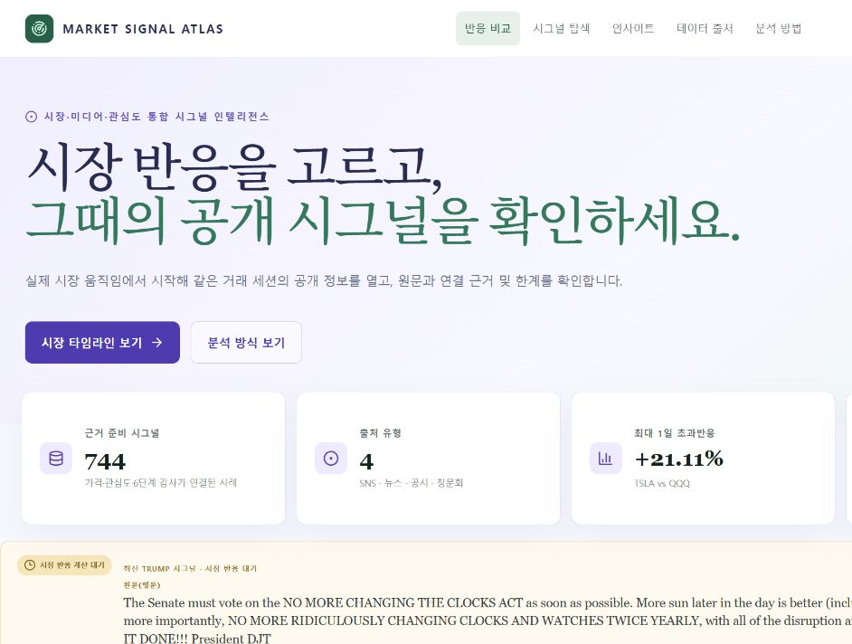

# Market Signal Atlas

> 공개 발언·뉴스·공시·청문회가 등장한 시점에 시장, 미디어, 대중 관심에서 어떤 반응이 함께 관찰됐는지 탐색하는 이벤트 인텔리전스 서비스

이 프로젝트는 [Codex Community Korea Hackathon Seoul 2026](https://codex-community-korea.skysplit.chatgpt.site/hackathon/seoul-2026) 출품작입니다.

[](https://market-mover.vercel.app/)
[](https://market-mover.vercel.app/ko)
[](#로컬-실행과-검증)

## 심사위원 접속 링크

- 영문 기본 화면: [market-mover.vercel.app](https://market-mover.vercel.app/)
- 한국어 화면: [market-mover.vercel.app/ko](https://market-mover.vercel.app/ko)
- 기본 주소로 접속했다면 우측 상단의 `한국어`를 누르면 됩니다.

로그인, 결제, 개인 API 키 입력 없이 바로 사용할 수 있습니다.

## 데모 화면



## 빠른 시작

다음 순서로 주요 기능을 확인할 수 있습니다.

### 1. 시장 움직임에서 시작하기

1. 첫 화면에서 `시장 타임라인 보기`를 누릅니다.
2. `SPY`, `QQQ`, `BTC-USD` 중 하나를 선택합니다.
3. 기간을 `최근 60 / 120 / 250 거래 세션` 중에서 선택합니다.
4. 실제 종가 위의 사건 마커를 누릅니다.

| 마커 | 의미 |
| --- | --- |
| `Direct` | 인물·기업과 자산의 직접 연결 |
| `Policy` | 정책·거시 발언과 시장 연결 |
| `Proxy` | 직접 상장사가 없어 산업·ETF·협력사를 프록시로 연결 |

마커를 누르면 해당 거래 세션의 대표 시그널이 선택되고 `시그널 탐색` 상세로 이동합니다. 마커는 인과관계가 아니라 같은 시점에 관찰된 공개 정보입니다.

### 2. 대표 사례 보기

`시그널 탐색`에서 아래 조건을 선택하면 대표적인 Musk–Tesla 사례를 빠르게 볼 수 있습니다.

```text
인물       Elon Musk
주제       Tesla & EV
연결 유형  Direct
정렬       1일 초과반응순
```

목록 첫 행과 중앙의 `선택 사건`에서 아래 사례를 확인할 수 있습니다.

```text
Elon Musk · TSLA · 2024-10-25
1일 초과반응 +21.11%
```

이 화면에서 원문, 출처 URL, 게시 시각, 장전·장중·장후 구분, 거래 세션 정렬, 거래량 배수와 3일 지속성을 함께 확인할 수 있습니다.

### 3. 한 사건에서 여러 자산 비교하기

선택 사건의 차트에서 다음 두 보기를 전환합니다.

- `동시 반응 비교`: 발언 직전 종가를 `0%`로 맞추고 주요 연결 자산·SPY·QQQ·BTC-USD를 같은 축에서 비교
- `실제 종가`: 선택 자산의 실제 달러 종가를 D-5부터 D+5까지 확인

차트의 세로선에는 원 게시 시각(ET)과 장 상태가 표시됩니다. 일봉 데이터로 게시 순간의 가격을 추정하지 않고, 실제 거래 세션 종가와 정확한 게시 시각을 분리합니다.

### 4. 가격 이외의 반응 확인하기

차트 위 반응 렌즈를 전환합니다.

- `시장`: 실제 가격 반응
- `뉴스`: 공개 뉴스 검색 결과의 일별 기사 수
- `대중 관심`: 공개 소셜 검색 표본의 게시물·해시태그 출현 수

뉴스 화면에는 검색 쿼리, 반환 구간, 기사 링크와 공급자가 표시됩니다. 대중 관심은 **Bluesky 공개 검색의 최대 100개 표본**이며 X 전체 언급량으로 표현하지 않습니다.

### 5. 근거 확인하기

우측 또는 모바일 상세 아래의 `근거 검토`에서 판정, 신뢰도와 핵심 한계를 먼저 확인합니다. `검토 과정 보기`를 누르면 다음 6단계가 펼쳐집니다.

1. 시그널 분류
2. 인물·주제·자산 매핑
3. 뉴스·소셜 확산 점검
4. 시장 반응 계산
5. 신뢰도 감사
6. 한국어·영문 리포트

시장 지표는 규칙과 실제 관측값으로 계산합니다. 모델은 없는 가격·기사·해시태그를 만들어내지 않습니다.

### 6. 전체 원문 검색하기

아래로 내려가면 `전체 시그널 유니버스`가 나옵니다.

- `전체 원문`: 32,393개
- `군집 대표`: 1,162개
- `근거 준비 완료`: 735개

검색창에 `tariff`, `Tesla`, `AI`, `bitcoin` 등을 입력하고 인물·단계·주제를 함께 필터링할 수 있습니다. 각 원문은 출처 URL과 군집 ID를 유지합니다.

## 주요 시나리오

### 시장에서 원문 찾기

`QQQ → 최근 60 거래 세션 → 사건 마커 클릭`

> 가격 움직임을 먼저 보고, 같은 거래 세션에 어떤 공개 정보가 있었는지 역으로 확인합니다.

### 하나의 시그널, 여러 자산

`Elon Musk → Tesla & EV → 동시 반응 비교`

> 하나의 게시물을 TSLA 하나에만 연결하지 않고 SPY·QQQ·BTC-USD와 함께 비교합니다. 직접 연결과 시장 맥락은 구분합니다.

### 시장·뉴스·관심도 함께 보기

`뉴스 → 대중 관심 → 근거 검토`

> 가격만 보여주는 대시보드가 아니라 원문, 정보 확산, 시장 반응, 해석 한계를 하나의 증거 경로로 연결합니다.

## 서비스 구현 목적

투자자와 리서처는 가격 급변 이후 원인을 찾기 위해 SNS, 뉴스, 공시, 가격 차트를 각각 검색해야 합니다. Market Signal Atlas는 공개 정보 한 건을 `Signal`로 표준화하고 다음 경로를 한 화면에서 연결합니다.

```text
시장 움직임
  → 같은 세션의 공개 시그널
  → 인물·주제·자산 연결
  → 실제 가격·거래량·지속성
  → 뉴스·공개 소셜 확산
  → 신뢰도와 해석 한계
```

이 서비스는 “발언이 가격을 움직였다”고 단정하지 않습니다. 시간적으로 함께 관찰된 반응을 비교하고, 사용자가 원문과 한계를 직접 검토하게 합니다.

## 데이터 범위

```text
원본 데이터 145,442행
→ 조건을 통과한 원문 32,393개
→ 군집 대표 1,162개
→ 근거 준비 SNS 시그널 735개
→ 뉴스 7개 + 공시 1개 + 청문회 1개
→ Main Atlas 총 744개
```

| 구분 | 현재 범위 |
| --- | --- |
| 인물 | Donald Trump, Elon Musk, Sam Altman 검토 사례 |
| 원문 출처 | Social, News, Filing, Hearing |
| 자산 | SPY, QQQ, TSLA, NVDA, MSFT, SOXX, BTC-USD |
| 시장 공통 기준 | 모든 사건에 SPY·QQQ·BTC-USD 제공 |
| 과거 가격 | 이벤트 D-5~D+5 실제 일봉 종가·거래량 |
| 최신 발언 | 독립 공개 아카이브의 Trump RSS, 하루 캐시 |
| 최신 가격 | Twelve Data 키가 있으면 5개 미국 자산 일봉 갱신, 없으면 스냅샷 |
| 뉴스 | Google News RSS 검색 → GDELT 보조 → 검토 스냅샷 fallback |
| 공개 소셜 | Bluesky 공개 검색 표본 → 추적 코퍼스 fallback |

Trump와 Musk는 전체 로컬 이력을 사용합니다. Sam Altman은 완전한 공개 원본 코퍼스가 없어 검토된 뉴스·공개 발언 사례만 제공합니다.

## 핵심 지표

### Abnormal Return 1D

```text
연결 자산의 1일 수익률 − 비교 기준 자산의 1일 수익률
```

### Volume Multiple

```text
이벤트 거래 세션 거래량 ÷ 직전 20거래일 평균 거래량
```

### 3D Persistence

3거래일 누적 초과수익률을 `Persisted / Faded / Reversed`로 구분합니다.

불투명한 단일 Impact Score는 사용하지 않습니다. 사용자는 1일 초과반응, 거래량, 3일 지속성, 최신순 중 정렬 기준을 직접 선택합니다.

## 분석 기준

- 정확한 게시 시각은 미국 동부시간(ET)으로 표시합니다.
- 장 마감 후, 주말, 휴일 발언은 다음 미국 거래 세션에 정렬합니다.
- 날짜만 확인되는 출처는 `날짜 단위`로 표시합니다.
- 일봉에서는 게시 순간의 가격을 추정하지 않습니다.
- BTC-USD는 현재 주식 거래 세션 날짜에 표본화된 비교 맥락이며 완전한 24/7 분봉 분석이 아닙니다.

## 데이터 처리 방식

기본 분석은 규칙과 실제 관측값을 사용합니다.

| 단계 | 처리 방식 |
| --- | --- |
| 가격·거래량·수익률 | 실제 데이터와 고정 수식 |
| 토픽·자산 후보 | 검토 데이터 + 공개된 규칙 |
| 뉴스·소셜 | 외부 공개 검색 또는 명시된 fallback |
| 신뢰도 | 출처·시간 정밀도·직접/프록시·결측 규칙 |
| 리포트 | 기본은 결정론적, OpenAI는 서버에서 명시적으로 활성화할 때만 보조 |

OpenAI 보조 경로가 실패하거나 비활성화되어도 가격 계산과 근거 화면은 그대로 동작합니다. API 키는 브라우저에 노출하지 않습니다.

## 기술 스택

| 구분 | 사용 기술 |
| --- | --- |
| 웹 애플리케이션 | Next.js 16 (App Router), React 19, TypeScript |
| UI·시각화 | Tailwind CSS 4, Recharts, Lucide React |
| 데이터 처리 | Node.js 스크립트, CSV Parse, Fast XML Parser |
| 테스트·품질 | Vitest, ESLint |
| 배포·스케줄링 | Vercel, Vercel Cron |
| 선택형 데이터·AI 연동 | Twelve Data, OpenAI Responses API, Google News RSS, GDELT, Bluesky 공개 검색 |

### 처리 구조

```text
로컬 공개 데이터셋 / 검토된 공식 원문
  → 전처리·중복 제거·주제 군집화
  → Yahoo 일봉 가격·거래량 근거 생성
  → 작은 배포용 JSON
  → Next.js App Router
  → 선택 사건별 뉴스·공개 소셜 조회
  → Vercel Production + 일일 Cron
```

## API

| 경로 | 역할 |
| --- | --- |
| `GET /api/live` | 최신 Trump RSS와 시장 스냅샷 |
| `GET /api/signals` | 전체 원문·군집·근거 레이어 검색 및 페이지네이션 |
| `GET /api/news?eventId=...` | 선택 사건의 뉴스·공개 소셜 근거 |
| `POST /api/research` | 결정론적 근거 검토 및 선택형 OpenAI 보조 리포트 |
| `GET /api/cron/refresh` | 인증된 일일 upstream 캐시 갱신 |

## 로컬 실행

```bash
npm install
npm run dev
```

- 영문: http://localhost:3000
- 한국어: http://localhost:3000/ko

필요하면 아래 명령으로 검사와 빌드를 실행합니다.

```bash
npm run lint
npm test
npm run build
```

테스트는 계산, 데이터 고유 ID, 출처 URL, 공통 시장 자산, 이벤트 세션 정렬과 데이터 레이어를 확인합니다.

## API 키 및 환경 변수

`.env.example`을 `.env.local`로 복사하고 필요한 값만 설정합니다.

기본 화면과 내장 데이터는 API 키 없이 실행됩니다. 아래 값은 실시간 갱신, 서버 API 인증, 선택형 AI 보조 기능을 사용할 때만 필요합니다.

| 변수 | 필요 여부 | 용도 |
| --- | --- | --- |
| `TWELVE_DATA_API_KEY` | 선택 | 일일 시장 가격 갱신 |
| `CRON_SECRET` | 선택 | `/api/cron/refresh` 인증 |
| `OPENAI_API_KEY` | 선택 | 서버 측 모델 보조 리포트와 Batch 작업 |
| `OPENAI_MODEL` | 선택 | 모델 보조 리포트 모델 |
| `OPENAI_BATCH_MODEL` | 선택 | Batch 분류 모델 |
| `ENABLE_LIVE_AI` | 선택 | `true`일 때 모델 보조 리포트 사용 |

```env
TWELVE_DATA_API_KEY=
CRON_SECRET=

# 선택 사항: 서버 전용 OpenAI 보조 리포트
OPENAI_API_KEY=
OPENAI_MODEL=gpt-5.4-nano
OPENAI_BATCH_MODEL=gpt-5.4-nano
ENABLE_LIVE_AI=false
```

`OPENAI_API_KEY`는 Git에 커밋하거나 `NEXT_PUBLIC_` 접두사를 붙이지 않습니다. 공개 사용자는 자신의 키를 입력하지 않으며, 브라우저는 Next.js 서버 API만 호출합니다.

## 주요 파일

| 파일 | 역할 |
| --- | --- |
| `components/signal-atlas-dashboard.tsx` | Market Timeline, 사건 탐색, 멀티 자산 비교, 근거 검토 UI |
| `components/signal-universe.tsx` | 32,393개 전체 원문 검색 UI |
| `lib/gdelt.ts` | 뉴스·공개 소셜 검색과 fallback |
| `lib/orchestration.ts` | 결정론적 근거 검토와 선택형 OpenAI 보조 |
| `scripts/build-events.mjs` | 검토 사건과 실제 가격창 생성 |
| `scripts/build-signal-catalog.mjs` | 전체 원문 카탈로그 생성 |
| `scripts/build-evidence-universe.mjs` | 군집 대표와 근거 준비 레이어 생성 |
| `BUILD_LOG.md` | Codex 활용 과정과 주요 구현 결정 |

## 유의 사항

Market Signal Atlas는 연구·모니터링 도구이며 투자 조언, 매수·매도 추천, 가격 예측 서비스가 아닙니다. 공개 정보와 시장 반응의 시간적 연관성은 인과관계를 증명하지 않습니다.
