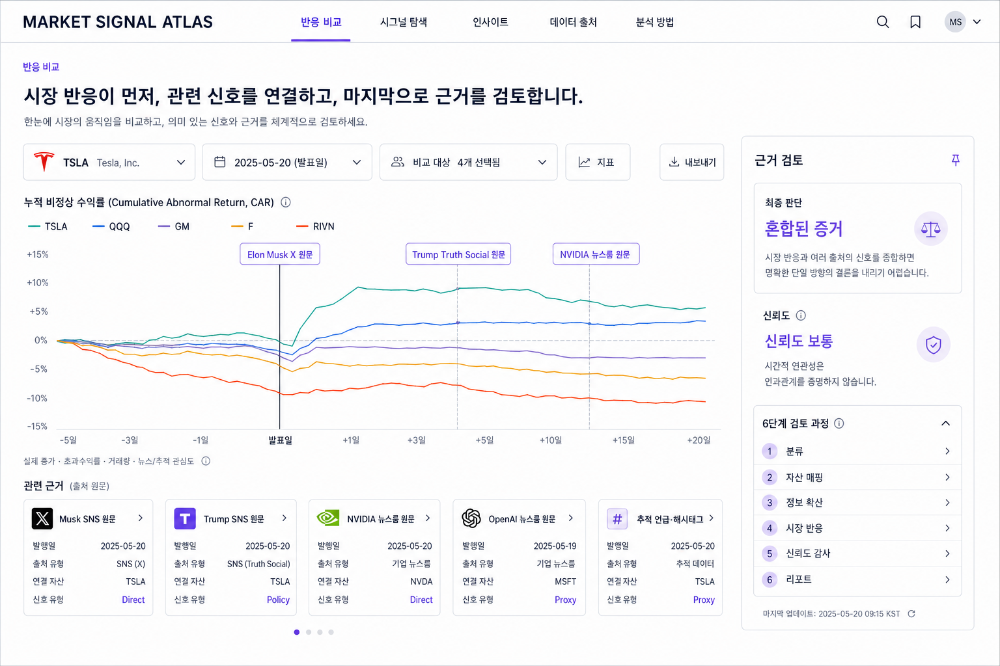
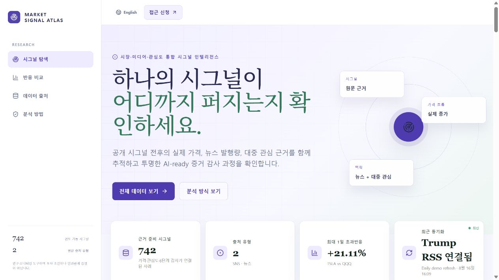
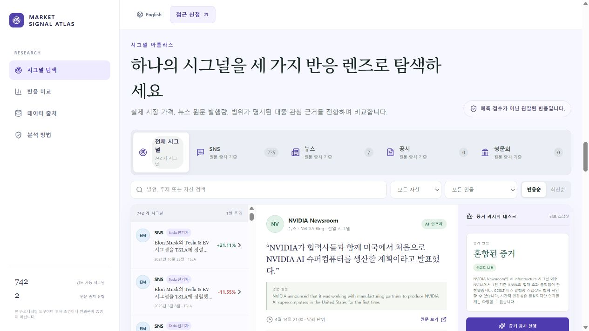
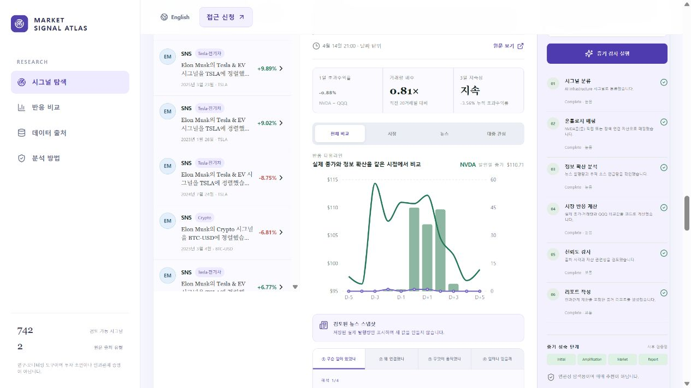
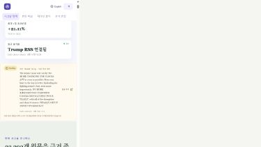

# Market Signal Atlas — 첫 방문자 UI/UX 감사

> 감사 기준: 2026-08-16, 배포된 한국어 화면 `https://market-mover.vercel.app/ko`를 데스크톱과 390px 모바일 폭에서 직접 탐색했다. 아래 캡처는 같은 세션에서 저장한 실제 화면이며, 평가는 **처음 온 사용자가 “무엇을 보고, 무엇을 클릭하고, 어떤 결론을 얻는가”**를 기준으로 한다.

## 결론

현재 화면은 데이터 출처와 분석의 정직성을 잘 보여 주지만, 첫 방문자에게는 **“AI 기반 데이터셋/리서치 소개 페이지”**로 먼저 읽힌다. 사용자가 기대하는 핵심 질문인 “어떤 시장 반응이 있었고, 그때 어떤 시그널이 있었나?”에는 빠르게 도달하지 못한다.

가장 큰 원인은 세 가지다.

1. 첫 CTA가 `전체 데이터 보기`여서 핵심 분석이 아닌 대규모 카탈로그로 이동한다.
2. 메뉴의 `반응 비교`는 실제로는 자산·기간·사건을 비교하는 화면이 아니라 요약 KPI 3개다.
3. 사건 상세의 차트가 작고 AI 감사 패널에 밀려, 정작 시장 반응을 읽기 어렵다.

따라서 정보 구조의 출발점을 **반응 비교 → 연결된 시그널 탐색 → 근거 검토**로 바꿔야 한다. ‘시그널 탐색’은 독립적인 첫 메뉴가 아니라 시장 반응에서 출발한 상세 탐색 단계가 되어야 한다.

---

## 이상적인 프론트 UI 시안



이 시안은 구현 코드가 아니라, 위 감사의 P0 원칙을 한 화면에 묶은 **디자인 방향 캡처**다. 특히 다음을 의도했다.

- 전역 메뉴와 활성 상태의 첫 항목이 `반응 비교`다.
- 자산·기간·비교군을 차트보다 먼저 고르고, 주 차트에서 자산/benchmark/peer의 누적 초과수익률을 직접 비교한다.
- 사건 마커를 클릭하면 아래의 관련 시그널 카드로 연결되는 구조다.
- 우측 `근거 검토`는 판정·신뢰도·한계만 먼저 보여 주고, 상세 단계는 접어서 차트의 우선순위를 침범하지 않는다.
- 레이더 장식, 큰 AI 문구, 과도한 배지 대신 시장 반응·비교군·근거 상태를 전면에 둔다.

시안 안의 일부 상세 카드/수치는 레이아웃 설명용 예시다. 실제 구현에서는 기존 데이터 모델의 `Direct / Policy / Proxy`, 원문 링크, 결측 상태, 인과관계 제한 문구를 그대로 적용해야 한다.

### UI 정합성 규칙 — 실제로 동작하지 않는 기능은 프론트에 두지 않는다

이 제품은 리서치·근거 검토 도구이므로, 예쁜 목업보다 **기능과 화면의 일치**가 우선이다. 아래 규칙을 디자인·개발 완료 기준으로 고정한다.

| 규칙 | 허용 | 금지 |
| --- | --- | --- |
| 클릭·탭·필터 | 현재 배포본에서 결과를 바꾸는 요소만 노출 | 화면 전환, 필터링, 차트 변경이 없는 버튼/탭을 기능처럼 노출 |
| 차트·비교 | 실제로 제공되는 자산·기간·비교군·가격 창만 표시 | 아직 계산/데이터가 없는 peer 비교, 실시간 분봉, 사건 마커를 완료 기능처럼 표시 |
| 신호 카드 | 실제 저장된 SNS·뉴스룸 원문과 실제 원문 링크·자산 매핑 사용 | 애널리스트 코멘트, 실적 발표, 가이던스, 밸류에이션 등 수집하지 않은 신호를 카드로 생성 |
| AI/근거 검토 | 현재의 결정론적 `분류 → 자산 매핑 → 정보 확산 → 시장 반응 → 신뢰도 감사 → 리포트`만 표기 | 생성형 AI 실시간 분석, 새 사실 조사, 수치형 신뢰도 점수, 투자 판단을 실제 기능처럼 암시 |
| 데이터 상태 | 실제 공급자, 마지막 갱신 시각, `Fresh/Stale/Pending`과 결측 상태를 그대로 표시 | 최신 가격·뉴스·소셜 범위를 추정하거나 stale 데이터를 실시간처럼 표시 |
| 미래 기능 | 구현 전에는 문서/로드맵에서만 `계획됨`으로 표시 | 홈 CTA, 가격표, 메뉴에 즉시 이용 가능한 기능처럼 배치 |

#### 시안 적용 범위

현재 시안의 **레이아웃 원칙**(반응 비교 우선, 큰 차트, 근거 검토 접기)은 적용 후보지만, `TSLA·QQQ·GM·F·RIVN` 다중 비교선·기간 브러시·차트 사건 마커·아래 관련 근거 카드 탐색은 현재 배포본에 완성되어 있지 않다. 따라서 이들은 구현 완료 전까지 프로덕션 화면에 넣지 않으며, 문서에서는 `제안 UI`로만 다룬다.

현 배포본에서 즉시 사용할 수 있는 기능은 다음으로 한정해 명시한다.

- 전체/근거 준비 시그널 검색 및 페이지네이션
- 출처·자산·인물 필터, 반응순/최신순 정렬
- 선택 사건의 원문·가격 창·1일 초과수익률·거래량 배수·3일 지속성 확인
- 시장/뉴스/대중 관심 렌즈 전환
- 뉴스 근거 조회와 스냅샷/결측 상태 표시
- 규칙 기반 6단계 근거 검토 실행

새 UI를 배포하기 전에는 각 버튼/탭/카드에 대해 아래 수용 테스트를 통과해야 한다.

1. 클릭 시 실제 상태·URL·필터·차트·상세 패널 중 적어도 하나가 사용자가 기대하는 방식으로 변한다.
2. 선택 사건의 목록 행, 원문, 수치, 차트, 근거 검토가 같은 `eventId`를 가리킨다.
3. 데이터가 없거나 API가 stale이면 버튼을 숨기거나 비활성화하고, 이유와 마지막 갱신 시각을 표시한다.
4. 미래 기능은 CTA가 아니라 `계획됨` 라벨이 붙은 로드맵에서만 노출한다.

---

## 1. 첫 방문 흐름에서 발견한 문제

### 1-1. 히어로: 제품의 핵심 행동이 보이지 않는다



#### 사용자가 보게 되는 것

- 큰 메시지: “하나의 시그널이 어디까지 퍼지는지 확인하세요.”
- 보조 문구: 실제 가격·뉴스·대중 관심·AI-ready 증거 감사
- 주요 CTA: `전체 데이터 보기`
- 두 번째 CTA: `분석 방식 보기`

#### 사용자 불편

- “시그널이 어디까지 퍼지는지”는 추상적이다. 시장 반응을 보고 싶은 사용자에게 **무엇을 먼저 선택/비교할 수 있는지** 알려 주지 않는다.
- 두 CTA 모두 제품의 핵심 작업(반응 비교·사건 분석)으로 바로 연결되지 않는다.
- 우측 레이더 장식과 `AI-ready` 표현이 데이터 분석보다 AI 데모 같은 첫인상을 만든다.
- 한국어 화면인데 최신 신호 카드의 원문·`Pending`·주제는 영어다. 원문을 보여 주는 것은 맞지만 “번역되지 않은 원문”이라는 표지와 짧은 한국어 요약이 없어 혼합 언어가 오류처럼 보인다.
- 첫 화면 하단 KPI는 사례 수·출처 유형·RSS 연결 상태를 강조한다. 서비스가 사용자에게 주는 답보다 운영 상태가 먼저 보인다.

#### 개선안 — P0

- 히어로 제목을 행동/결과 중심으로 바꾼다. 예: **“시장 반응을 고르고, 그때의 공개 시그널을 확인하세요.”**
- 주 CTA는 `반응 비교 시작`으로 하고 `#comparison`의 새 Market Timeline으로 연결한다.
- 보조 CTA는 `대표 사건 보기`로 둔다. `전체 원문 검색`은 텍스트 링크 또는 하위 CTA로 낮춘다.
- 레이더 일러스트 대신 작고 실제적인 **데이터 상태 바**를 둔다: `742개 근거 준비 사례 · Trump RSS 최신 · 가격 데이터 일부 지연`.
- 최신 신호는 “실시간 모니터링” 카드로 축약한다. `원문(영문)`, `시장 반응 계산 대기`, `한국어 요약 없음`을 구분해 표기한다.
- KPI는 아래 4개처럼 사용자 질문에 연결한다.

| KPI | 사용자가 받는 답 | 클릭 결과 |
| --- | --- | --- |
| 최근 관찰 완료 | 오늘/최근 시장 세션이 정렬된 사건 수 | 최신 사건 목록 |
| 가장 큰 반응 | 자산·사건·절대 초과수익률 | 해당 사건/차트 |
| 주목 토픽 | 표본 수를 포함한 중앙값 반응 | 토픽 인사이트 |
| 데이터 상태 | 제공자별 마지막 갱신과 지연 여부 | 출처 상세 |

---

### 1-2. 첫 CTA: 핵심 도구보다 데이터 카탈로그를 먼저 보여 준다


#### 사용자가 보게 되는 것

`전체 데이터 보기`를 누르면 32,393개 원문, 145,442개 원본 행, 군집 대표, 근거 보강, AI-ready 파이프라인과 검색 테이블이 먼저 나온다. 그 뒤에야 사건 탐색 화면이 나온다.

#### 사용자 불편

- 처음 온 사용자는 “이 사이트에서 지금 무엇을 할 수 있는가?”보다 “데이터를 어떻게 쌓았는가?”를 먼저 학습해야 한다.
- 5단계 파이프라인, 5개 통계, 3개 scope 탭, 4개 필터가 한 번에 나온다. 탐색 목적이 분명하지 않은 상태에서 선택 부담이 크다.
- 기본 레이어가 `근거 준비 완료 735`인데, 상단에서 실제 값이 로드되기 전에는 0/—로 잠시 보인다. 첫 인상에서 데이터가 고장 난 것처럼 보일 수 있다.
- `AI-ready conditional orchestration` 배지는 사용자가 결과의 신뢰도를 이해하는 데 직접 도움이 되지 않는다.

#### 개선안 — P0

- Signal Universe를 메인 분석 흐름 **뒤** 또는 별도 `/universe` 페이지로 이동한다.
- 홈에서는 `전체 원문 32,393개 검색 가능`이라는 작은 신뢰 배지와 링크만 남긴다.
- URL/CTA 이름도 목적에 맞춘다: `전체 원문 검색`, `데이터 범위 보기`. `전체 데이터 보기`라는 표현은 핵심 분석으로 이동할 것 같은 기대를 만든다.
- 데이터가 아직 로드되지 않은 경우 0이나 `—` 대신 카드형 skeleton과 `목록 준비 중`을 보여 준다.
- 파이프라인은 발표·방법론에서는 유지하되, 일상 사용 화면에서는 접힌 “데이터 처리 방식”으로 둔다.

---

### 1-3. 사건 탐색: 목록의 첫 사건과 상세 패널이 서로 다르다



#### 확인된 상태

- 좌측 목록의 최상단은 Elon Musk–TSLA `+21.11%` 사례다.
- 중앙 상세 패널은 NVIDIA Newsroom–NVDA `-0.88%` 사례를 보여 준다.
- 우측에는 이 NVIDIA 사례의 6단계 증거 감사가 보인다.

#### 사용자 불편

이 화면은 처음 보는 사람에게 **좌측에서 선택된 결과가 중앙에 표시된다는 기본 규칙을 깨는 것처럼** 보인다. 목록을 정렬/필터했을 때 무엇이 선택됐는지 명확하지 않아, 사용자는 “+21.11%의 내용을 보고 있다”고 생각한 채 `-0.88%` 차트를 읽을 수 있다.

또한 기본 정렬이 `반응순`인데 중앙은 그 정렬의 1위 사건이 아니다. 가장 큰 반응을 빠르게 보고 싶어 들어온 사용자의 기대가 어긋난다.

#### 개선안 — P0

- 목록이 최초 렌더링되거나 필터·정렬이 바뀌면 선택 사건을 **필터 결과의 첫 번째 사건으로 동기화**한다. 단, 사용자가 명시적으로 선택한 사건은 현재 필터에 남아 있는 동안 유지한다.
- 선택된 행은 배경색만이 아니라 `선택됨`, asset, 날짜, 방향을 명확히 보여 준다.
- 중앙 상단에 `선택 사건: Elon Musk · TSLA · 2024-10-25` 같은 고정된 breadcrumb를 표시한다.
- 목록의 기본 정렬은 ‘반응순’이되, 차트도 그 1위 사건으로 시작한다. 최신성을 기본으로 할 경우에는 `최근 관찰 사례`라는 명확한 제목을 붙인다.

### 1-4. 탐색 필터는 많지만 사용자의 질문 순서와 다르다

#### 현재 구조

출처 탭(전체/SNS/뉴스/공시/청문회) → 텍스트 검색 → 자산 → 인물 → 반응순/최신순이다.

#### 사용자 불편

- `공시`, `청문회`는 0건인데도 동일한 크기의 탭으로 노출된다. 클릭 실패를 예상하게 하고 정보 밀도를 낮춘다.
- 사용자가 가장 먼저 필요로 하는 **기간**, **주제**, **연결 강도(직접/정책/프록시)**, **뉴스 근거 유무** 필터는 여기 없다.
- `반응순`은 1일 초과수익률의 절대값이라는 설명이 부족하다. “반응”이 가격 변동인지 뉴스량인지 관심도인지 처음엔 알기 어렵다.
- 시장에서 시작하려는 사용자는 기간/자산을 고른 뒤 그 구간의 사건을 봐야 하는데, 현재는 사건 목록 전체에서 텍스트를 먼저 찾아야 한다.

#### 개선안 — P1

- 0건 출처는 숨기거나 비활성 상태에 `데이터 준비 중`을 보여 준다.
- 1차 필터: `자산군`, `자산`, `기간`, `반응 임계값`.
- 2차 필터: `인물/기관`, `주제`, `출처`, `Direct · Policy · Proxy`, `뉴스 근거 있음`.
- 정렬의 완전한 이름을 쓴다: `절대 1일 초과수익률순`, `최신 게시순`.
- 선택 조건을 상단에 chip으로 고정하고 `초기화`를 제공한다.

---

### 1-5. 차트: 가장 중요한 증거가 작고, 단위가 섞여 있다



#### 사용자가 보게 되는 것

중앙에는 약 10거래일의 실제 종가 선과 뉴스/관심도 막대가 같이 보이고, 오른쪽에는 6단계 증거 감사가 같은 높이로 상시 노출된다. 렌즈 탭은 `전체 비교 / 시장 / 뉴스 / 대중 관심`이다.

#### 사용자 불편

- 차트의 가로·세로 면적이 작아 가격 곡선, 사건일, 뉴스량의 관계를 읽기 어렵다.
- 기본 `전체 비교`는 달러 가격, 기사 수, 추적 언급 수를 한 프레임에 얹는다. 축이 달라서 “선과 막대의 높이 차이”를 의미 있는 비교로 오해하기 쉽다.
- `반응 비교`라는 서비스 핵심에 비해 실제로 비교되는 것은 선택 자산의 가격 창뿐이다. QQQ benchmark와 TSLA peer/다른 자산은 차트에 함께 나타나지 않는다.
- 사건일 마커는 있으나 발언 시간·장중/장후·다음 거래일 정렬의 의미가 눈에 띄지 않는다.
- 오른쪽 증거 감사가 항상 열려 있어 사용자가 시장 반응보다 규칙 단계부터 읽게 된다.
- 차트 아래 4단계 해석까지 탭이 연속되어 있어 탭의 역할이 중첩된다. `반응 렌즈`와 `해석 단계`를 구분하기 어렵다.

#### 개선안 — P0

- 차트를 원문 카드 안이 아니라 별도 주 영역으로 분리하고 데스크톱 기준 최소 `height: 380px`을 확보한다.
- 기본 차트는 **누적 초과수익률 비교**로 바꾼다: `연결 자산 / benchmark / peer group`. 가격(달러)은 `실제 가격 보기` 전환으로 분리한다.
- 뉴스량·관심도는 큰 차트의 보조 패널(아래 96~120px)로 분리한다. 서로 다른 단위를 같은 시각적 높이로 비교하지 않는다.
- 사건일에 `발언 14:32 ET`, `장후 → 다음 세션 정렬`처럼 해석 가능한 라벨을 표시한다.
- 렌즈의 기본값은 `시장 반응`으로 두고 `뉴스`, `대중 관심`은 보조 탭으로 둔다. `전체 비교`는 3개 패널을 세로로 쌓는 보기로 바꾼다.
- `Evidence Review`는 차트 오른쪽의 얇은 요약 카드만 기본 노출한다: 판정, 신뢰도, 핵심 한계. 6단계는 `검토 과정 보기`를 눌러 확장한다.
- 4단계 해석은 차트 바로 아래의 아코디언 또는 “읽는 법”으로 단일화한다. 탭 수를 늘리지 않는다.

---

### 1-6. `반응 비교` 메뉴는 이름과 실제 콘텐츠가 다르다


#### 사용자 불편

`반응 비교`를 클릭하면 시장 반응 `+0.89%`, 미디어 반응 `45`, 대중 관심 `104`의 요약 카드만 나온다. 이 세 값은 단위도 서로 다르고, 자산·기간·사건 선택도 없다. 사용자가 예상하는 “두 자산/두 사건/두 기간을 비교하는 기능”은 제공되지 않는다.

이는 단순한 디자인 문제가 아니라 **메뉴 약속과 기능의 불일치**다. 사용자는 클릭 후 다시 시그널 탐색으로 돌아가야 하며, 제품의 핵심 가치를 가장 직접적으로 보여 줄 메뉴가 오히려 약하다.

#### 개선안 — P0

`반응 비교`를 첫 메뉴와 첫 진입 화면으로 승격하고 아래 기능을 실제로 제공한다.

```text
자산군 [주식/ETF | Crypto]
자산 [TSLA]  비교군 [QQQ + GM + F + RIVN]  기간 [2023-01-01 ~ 2025-12-31]

┌────────── 가격 또는 누적 초과수익률 타임라인 ──────────┐
│ 사건 마커: 클릭하면 해당 시점의 공개 시그널 목록을 연다 │
└───────────────────────────────────────────────────┘

[선택 구간의 시그널] [뉴스/관심도 요약] [원문·연결 근거]
```

- 기본 진입은 대표 시나리오 하나로 시작한다. 예: `Musk × TSLA / QQQ / EV peers`.
- 기간 브러시 또는 날짜 클릭으로 해당 구간의 사건 목록을 필터한다.
- 마커는 `Direct`, `Policy`, `Proxy`를 모양과 범례로 구분한다.
- 요약 카드 3개는 타임라인 위의 선택 구간 요약으로 남기되, 독립 섹션의 전부가 되지 않게 한다.

### 메뉴 순서 권장

1. **반응 비교** — 시장에서 출발: 자산·기간·비교군을 고른다.
2. **시그널 탐색** — 선택한 변동 구간과 연결된 원문을 좁혀 본다.
3. **인사이트** — 토픽·인물·자산별 패턴을 본다.
4. **데이터 출처 / 분석 방법** — 근거 범위와 계산식을 검토한다.

따라서 현재의 `시그널 탐색 → 반응 비교 → 데이터 출처 → 분석 방법` 순서는 바뀌어야 한다. 로고, 히어로 CTA, 기본 앵커도 모두 `반응 비교`로 연결한다.

---

### 1-7. 모바일: 현재 레이아웃은 실사용이 어렵다



#### 확인된 상태

390px 폭에서 콘텐츠가 정상 폭으로 다시 배치되지 않고, 화면 왼쪽에 축소된 카드 일부만 보이며 오른쪽에 큰 빈 공간이 남는다. 첫 방문자가 제목·CTA·탐색 기능을 읽고 누르기 어렵다.

#### 개선안 — P0 버그 수정

- 375px, 390px, 430px, 768px에서 실제 기기 폭 QA를 통과하기 전에는 모바일 지원을 완료로 보지 않는다.
- 모바일에서 3열 탐색 화면은 다음 순서로 한 열 배치한다: `필터 → 선택 사건 요약 → 대형 차트 → 근거 요약 → 사건 목록`.
- 고정 좌측 사이드바는 제거하고, 상단에 `반응 비교 / 시그널 / 인사이트` 3개만 가로 스크롤 탭으로 둔다.
- 최소 터치 영역 44px, 본문 14px 이상, 메타 12px 이상을 적용한다.
- 차트에는 가로 스크롤을 쓰지 말고, 범례 토글/기간 축약으로 폭 안에 맞춘다.

---

## 2. AI스럽게 보이는 원인과 수정 원칙

| 현재 인상 | 왜 AI 템플릿처럼 보이는가 | 수정 방향 |
| --- | --- | --- |
| 연한 보라 그라데이션·레이더 궤도·작은 배지 | 실질 데이터보다 기술적 분위기를 먼저 전달 | 장식은 축소하고 실제 시계열/상태/범례를 전면에 배치 |
| `AI-ready`, `증거 리서치 데스크`, 6단계 상시 노출 | AI가 결론을 생산한다는 기대를 만듦 | `근거 검토`로 명명하고 단계는 접기. 규칙 기반·예측 아님을 한 번만 명확히 표시 |
| 7~10px 보조글자와 대문자 kicker 다수 | 읽기보다 ‘대시보드 미학’에 치우친 인상 | 본문 14px, 보조 12px, 메타 11px 이상. kicker·배지는 꼭 필요한 상태에만 사용 |
| 카드와 테두리의 반복 | 모든 정보가 같은 중요도로 보임 | 카드 수를 줄이고, 메인 차트·선택 사건·행동 버튼만 강한 위계를 부여 |
| 한글 UI 안의 영문 원문/상태 혼합 | 의도된 데이터 원문인지 미번역인지 구별 안 됨 | 원문에는 `원문(영문)` 표기, 한국어 요약 우선, 상태 용어 한글화 |

### 타이포그래피 기준

- UI 기본: `Pretendard Variable, Inter, system-ui, sans-serif`.
- 원문 인용: 영어 원문에만 Georgia 계열 serif를 제한적으로 쓴다. 한국어 요약은 산세리프를 유지한다.
- 페이지 제목 32~40px, 섹션 제목 24~28px, 카드 제목 16~18px, 본문 14px, 보조 12px, 메타 11px 이상.
- 수익률만 색으로 전달하지 말고 `▲/▼`, 플러스/마이너스 기호, 텍스트 레이블을 함께 쓴다.

---

## 3. 권장 첫 방문 사용자 흐름

```text
홈 진입
  → “반응 비교 시작”
  → 자산·기간·비교군을 고른 Market Timeline
  → 변동 구간/사건 마커 클릭
  → 연결된 시그널 목록에서 원문 선택
  → 대형 차트와 뉴스·관심도 보조 근거 확인
  → 필요할 때만 연결 논리·한계·6단계 검토 열기
  → 전체 원문 검색 또는 토픽 인사이트로 확장
```

이 구조는 “발언을 먼저 고르는” 현재 흐름도 보존한다. 다만 그것은 `시그널 탐색` 탭의 보조 진입점이며, 홈의 기본 흐름은 시장 반응에서 시작해야 한다.

## 4. 구현 우선순위와 완료 기준

### P0 — 다음 UI 업데이트에 포함

1. 390px 모바일 레이아웃 깨짐 수정 및 실제 기기 폭 QA
2. `반응 비교`를 최상위 메뉴·히어로 CTA·기본 진입으로 전환
3. `반응 비교`에 자산/기간/비교군/사건 마커가 있는 실제 타임라인 구현
4. Signal Universe를 메인 분석 뒤 또는 별도 페이지로 이동
5. 필터/정렬 변경 시 선택 사건과 중앙 상세 패널을 동기화
6. 차트를 독립 대형 영역으로 만들고, 6단계 감사는 접힌 보조 패널로 변경

### P1 — P0 직후

1. 기간·주제·Direct/Policy/Proxy·뉴스 근거 필터 추가
2. 0건 출처 탭 처리, 정렬 명칭 명확화, 선택 조건 chip/초기화 제공
3. 한글/영문 원문·상태의 표기 규칙 정리
4. 글자 크기·카드 수·배지 밀도 조정
5. 토픽/인물/자산 인사이트 화면 추가

### 완료 기준

- 처음 온 사용자가 5초 안에 “시장 반응과 공개 시그널을 연결해 보는 도구”라고 말할 수 있다.
- 첫 CTA가 전체 데이터셋이 아니라 실제 반응 비교 화면으로 이동한다.
- `반응 비교` 메뉴에서 적어도 자산·기간·비교군을 조작하고 사건을 클릭할 수 있다.
- 목록에서 보이는 선택 사건, 중앙 원문, 차트 제목, 우측 검토 요약이 항상 같은 사건을 가리킨다.
- 390px·768px·1440px에서 핵심 CTA·필터·차트·선택 사건이 가로 잘림 없이 읽힌다.
- AI는 “결론 생성기”가 아니라 필요할 때 열어 보는 재현 가능한 근거 검토로 인식된다.
